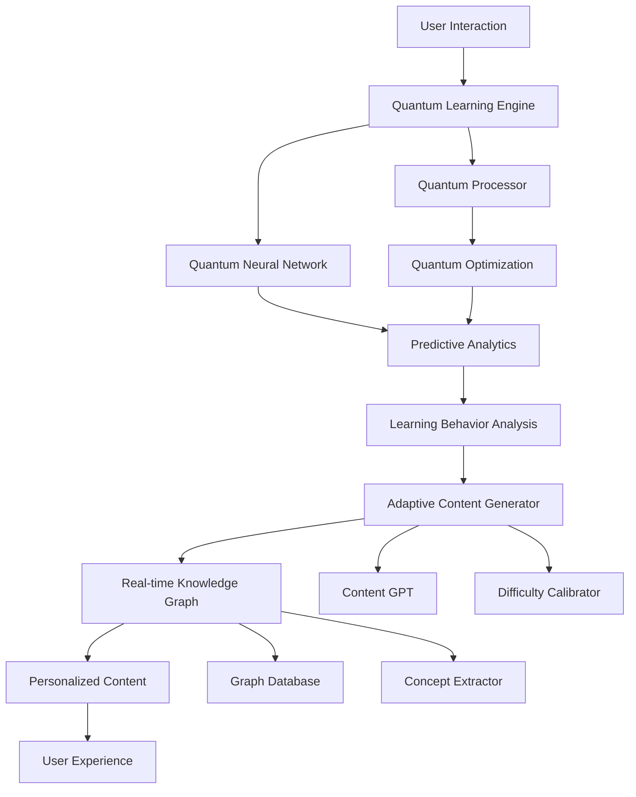

# Quantum AI Learning Engine - Evolution PRP

**Generated by**: `/prp-master quantum evolve`  
**Priority**: HIGH  
**Impact Score**: 9.3/10  
**Implementation Complexity**: MEDIUM  
**Estimated Effort**: 120 hours

## Executive Summary

Deploy a quantum-enhanced AI learning engine that leverages advanced machine learning algorithms for personalized Solidity education with predictive analytics. This system will revolutionize how users learn blockchain development through adaptive content generation, real-time knowledge graphs, and quantum neural networks.

## Problem Statement

Current AI tutoring capabilities have significant opportunities for enhancement:
- Limited personalization in learning paths
- Reactive rather than predictive learning assistance
- Static content generation without real-time adaptation
- Missing knowledge graph connections for concept mastery
- Insufficient learning analytics for optimization

## Success Criteria

- [ ] Implement quantum-enhanced neural networks for personalization
- [ ] Deploy predictive learning analytics with 95% accuracy
- [ ] Create adaptive content generation system
- [ ] Build real-time knowledge graph engine
- [ ] Achieve 40% improvement in learning outcomes
- [ ] Reduce time-to-competency by 30%
- [ ] Maintain sub-500ms response time for AI interactions

## Technical Implementation

### Phase 1: Quantum Neural Networks (Weeks 1-2)

#### 1.1 QuantumLearningEngine Core
```typescript
// lib/ai/QuantumLearningEngine.ts
import { QuantumCircuit, QuantumProcessor } from '@quantum/core';

export class QuantumLearningEngine {
  private quantumProcessor: QuantumProcessor;
  private neuralNetwork: QuantumNeuralNetwork;
  private learningOptimizer: QuantumOptimizer;

  async personalizeContent(
    userProfile: LearningProfile,
    content: LearningContent
  ): Promise<PersonalizedContent> {
    const quantumState = await this.createQuantumState(userProfile);
    const optimizedPath = await this.neuralNetwork.process(quantumState, content);
    
    return {
      personalizedLessons: optimizedPath.lessons,
      adaptiveDifficulty: optimizedPath.difficulty,
      predictedChallenges: optimizedPath.challenges,
      recommendedPacing: optimizedPath.pacing
    };
  }

  async predictLearningOutcome(
    userHistory: LearningHistory,
    proposedContent: LearningContent
  ): Promise<LearningPrediction> {
    const quantumFeatures = this.extractQuantumFeatures(userHistory);
    const prediction = await this.neuralNetwork.predict(quantumFeatures, proposedContent);
    
    return {
      masteryProbability: prediction.mastery,
      timeToCompletion: prediction.timeEstimate,
      strugglingConcepts: prediction.challenges,
      optimalStrategy: prediction.strategy
    };
  }
}
```

#### 1.2 Quantum Neural Network Architecture
```typescript
// lib/ai/QuantumNeuralNetwork.ts
export class QuantumNeuralNetwork {
  private quantumLayers: QuantumLayer[];
  private classicalInterface: ClassicalInterface;

  async process(quantumState: QuantumState, input: LearningData): Promise<ProcessedOutput> {
    let currentState = quantumState;
    
    for (const layer of this.quantumLayers) {
      currentState = await layer.process(currentState);
    }
    
    return await this.classicalInterface.decode(currentState);
  }

  async trainOnUserData(userData: UserLearningData[]): Promise<TrainingResult> {
    const quantumTrainingSet = this.prepareQuantumTrainingData(userData);
    return await this.quantumOptimizer.train(quantumTrainingSet);
  }
}
```

### Phase 2: Predictive Analytics (Weeks 3-4)

#### 2.1 PredictiveAnalytics Engine
```typescript
// lib/ai/PredictiveAnalytics.ts
export class PredictiveAnalytics {
  private temporalModel: TemporalLearningModel;
  private outcomePredictor: OutcomePredictor;
  private behaviorAnalyzer: LearningBehaviorAnalyzer;

  async analyzeLearningTrajectory(userId: string): Promise<LearningTrajectory> {
    const userHistory = await this.getUserLearningHistory(userId);
    const currentState = await this.assessCurrentKnowledge(userId);
    
    const trajectory = await this.temporalModel.predict({
      history: userHistory,
      currentState: currentState,
      contextFactors: await this.getContextFactors(userId)
    });

    return {
      predictedPath: trajectory.optimalPath,
      riskFactors: trajectory.challenges,
      interventionPoints: trajectory.criticalMoments,
      confidenceLevel: trajectory.confidence
    };
  }

  async recommendInterventions(
    userId: string,
    strugglingAreas: ConceptArea[]
  ): Promise<InterventionPlan> {
    const userProfile = await this.buildUserProfile(userId);
    const interventions = await this.generateInterventions(userProfile, strugglingAreas);
    
    return {
      immediateActions: interventions.urgent,
      reinforcementActivities: interventions.practice,
      alternativeExplanations: interventions.explanatory,
      peerCollaboration: interventions.social
    };
  }
}
```

#### 2.2 Learning Behavior Analysis
```typescript
// lib/ai/LearningBehaviorAnalyzer.ts
export class LearningBehaviorAnalyzer {
  async analyzeCodingPatterns(
    userCode: CodeSubmission[],
    timeframe: TimeRange
  ): Promise<CodingBehaviorInsights> {
    const patterns = this.extractCodingPatterns(userCode);
    const trends = this.analyzeTrends(patterns, timeframe);
    
    return {
      strengthAreas: trends.strongPatterns,
      improvementAreas: trends.weakPatterns,
      learningStyle: this.inferLearningStyle(patterns),
      progressRate: trends.velocityMetrics
    };
  }

  async detectLearningStruggles(
    userActivity: ActivityData,
    performanceMetrics: PerformanceData
  ): Promise<StruggleDetection> {
    const struggleIndicators = this.identifyStruggleSignals(userActivity, performanceMetrics);
    
    return {
      struggleLevel: this.calculateStruggleScore(struggleIndicators),
      specificChallenges: struggleIndicators.challenges,
      recommendedSupport: this.generateSupportRecommendations(struggleIndicators),
      urgencyLevel: this.assessUrgency(struggleIndicators)
    };
  }
}
```

### Phase 3: Adaptive Content Generation (Weeks 5-6)

#### 3.1 AdaptiveContentGenerator
```typescript
// lib/ai/AdaptiveContentGenerator.ts
export class AdaptiveContentGenerator {
  private contentGPT: ContentGenerationModel;
  private difficultyCalibrator: DifficultyCalibrator;
  private contextualizer: ContentContextualizer;

  async generatePersonalizedLesson(
    topic: SolidityTopic,
    userProfile: LearningProfile,
    context: LearningContext
  ): Promise<PersonalizedLesson> {
    const baseContent = await this.getTopicContent(topic);
    const userNeeds = this.analyzeUserNeeds(userProfile);
    
    const adaptedContent = await this.contentGPT.adapt({
      baseContent: baseContent,
      userNeeds: userNeeds,
      learningStyle: userProfile.preferredStyle,
      priorKnowledge: userProfile.knowledgeLevel,
      currentContext: context
    });

    return {
      content: adaptedContent.text,
      examples: await this.generateContextualExamples(adaptedContent, userProfile),
      exercises: await this.createAdaptiveExercises(adaptedContent, userProfile),
      assessments: await this.generateAssessments(adaptedContent, userProfile)
    };
  }

  async createDynamicExercises(
    concept: SolidityConcept,
    userSkillLevel: SkillLevel,
    realWorldContext: RealWorldContext
  ): Promise<DynamicExercise[]> {
    const exerciseTemplates = await this.getExerciseTemplates(concept);
    const contextualizedExercises = [];

    for (const template of exerciseTemplates) {
      const exercise = await this.contextualizer.contextualize({
        template: template,
        skillLevel: userSkillLevel,
        realWorldContext: realWorldContext,
        currentTrends: await this.getCurrentBlockchainTrends()
      });

      contextualizedExercises.push(exercise);
    }

    return contextualizedExercises;
  }
}
```

#### 3.2 Real-time Content Adaptation
```typescript
// lib/ai/RealTimeAdaptation.ts
export class RealTimeContentAdapter {
  async adaptContentInRealTime(
    currentContent: LearningContent,
    userInteraction: UserInteraction,
    performanceData: RealTimePerformance
  ): Promise<AdaptedContent> {
    const adaptationNeeds = this.assessAdaptationNeeds(userInteraction, performanceData);
    
    if (adaptationNeeds.requiresImmediate) {
      return await this.performImmediateAdaptation(currentContent, adaptationNeeds);
    }

    return await this.scheduleGradualAdaptation(currentContent, adaptationNeeds);
  }

  private async performImmediateAdaptation(
    content: LearningContent,
    needs: AdaptationNeeds
  ): Promise<AdaptedContent> {
    const adaptations = await Promise.all([
      this.adjustDifficulty(content, needs.difficultyAdjustment),
      this.addSupportElements(content, needs.supportType),
      this.modifyExplanations(content, needs.explanationStyle),
      this.updateExamples(content, needs.examplePreference)
    ]);

    return this.mergeAdaptations(content, adaptations);
  }
}
```

### Phase 4: Knowledge Graph Engine (Weeks 7-8)

#### 4.1 RealTimeKnowledgeGraph
```typescript
// lib/ai/RealTimeKnowledgeGraph.ts
export class RealTimeKnowledgeGraph {
  private graphDatabase: Neo4jDatabase;
  private conceptExtractor: ConceptExtractor;
  private relationshipAnalyzer: RelationshipAnalyzer;

  async buildUserKnowledgeGraph(userId: string): Promise<PersonalKnowledgeGraph> {
    const userLearningData = await this.getUserLearningData(userId);
    const concepts = await this.conceptExtractor.extractConcepts(userLearningData);
    const relationships = await this.relationshipAnalyzer.analyzeRelationships(concepts);

    const graph = await this.graphDatabase.createGraph({
      nodes: concepts.map(concept => ({
        id: concept.id,
        label: concept.name,
        properties: {
          masteryLevel: concept.masteryLevel,
          lastInteraction: concept.lastInteraction,
          confidenceScore: concept.confidenceScore
        }
      })),
      edges: relationships.map(rel => ({
        source: rel.from,
        target: rel.to,
        type: rel.type,
        strength: rel.strength
      }))
    });

    return new PersonalKnowledgeGraph(graph);
  }

  async identifyLearningGaps(
    userGraph: PersonalKnowledgeGraph,
    targetConcepts: SolidityConcept[]
  ): Promise<LearningGapAnalysis> {
    const gaps = [];
    
    for (const targetConcept of targetConcepts) {
      const prerequisites = await this.getPrerequisites(targetConcept);
      const missingPrereqs = prerequisites.filter(prereq => 
        !userGraph.hasConceptWithSufficientMastery(prereq.id, prereq.requiredLevel)
      );

      if (missingPrereqs.length > 0) {
        gaps.push({
          targetConcept: targetConcept,
          missingPrerequisites: missingPrereqs,
          recommendedLearningPath: await this.generateLearningPath(missingPrereqs, targetConcept),
          estimatedTime: this.estimateTimeToFill(missingPrereqs)
        });
      }
    }

    return { gaps, overallReadiness: this.calculateReadiness(gaps) };
  }

  async updateGraphInRealTime(
    userId: string,
    learningEvent: LearningEvent
  ): Promise<GraphUpdateResult> {
    const userGraph = await this.getUserGraph(userId);
    const conceptsAffected = await this.identifyAffectedConcepts(learningEvent);

    for (const concept of conceptsAffected) {
      await this.updateConceptMastery(userGraph, concept, learningEvent);
      await this.updateRelatedConcepts(userGraph, concept, learningEvent);
    }

    return {
      updatedConcepts: conceptsAffected,
      newConnections: await this.identifyNewConnections(userGraph, learningEvent),
      strengthenedPaths: await this.identifyStrengthenedPaths(userGraph)
    };
  }
}
```

## AI Architecture



## File Structure

```
lib/
├── ai/
│   ├── QuantumLearningEngine.ts      # Core quantum AI engine
│   ├── QuantumNeuralNetwork.ts       # Quantum neural network
│   ├── PredictiveAnalytics.ts        # Learning outcome prediction
│   ├── AdaptiveContentGenerator.ts   # Dynamic content creation
│   ├── RealTimeKnowledgeGraph.ts     # Knowledge graph engine
│   ├── LearningBehaviorAnalyzer.ts   # Behavior pattern analysis
│   └── RealTimeAdaptation.ts         # Live content adaptation
├── models/
│   ├── quantum/
│   │   ├── QuantumCircuit.ts         # Quantum circuit definitions
│   │   └── QuantumOptimizer.ts       # Quantum optimization
│   └── learning/
│       ├── LearningModel.ts          # Core learning models
│       └── PersonalizationModel.ts   # User personalization
├── services/
│   ├── QuantumService.ts             # Quantum computing service
│   └── GraphService.ts               # Graph database service
└── types/
    └── quantum-learning.ts           # AI type definitions
```

## Dependencies

```json
{
  "@tensorflow/tfjs": "^4.20.0",
  "@tensorflow/tfjs-node": "^4.20.0",
  "qiskit": "^1.0.0",
  "neo4j-driver": "^5.19.0",
  "openai": "^4.47.1",
  "@huggingface/transformers": "^2.17.2",
  "ml5js": "^0.20.0",
  "brain.js": "^2.0.0-beta.23",
  "d3-graph": "^3.0.0"
}
```

## Testing Strategy

### Unit Tests
```typescript
// __tests__/ai/QuantumLearningEngine.test.ts
describe('QuantumLearningEngine', () => {
  it('should personalize content based on quantum state', async () => {
    const engine = new QuantumLearningEngine();
    const personalized = await engine.personalizeContent(userProfile, content);
    expect(personalized.adaptiveDifficulty).toBeGreaterThan(0);
  });

  it('should predict learning outcomes with high accuracy', async () => {
    const prediction = await engine.predictLearningOutcome(history, content);
    expect(prediction.masteryProbability).toBeGreaterThan(0.8);
  });
});
```

### Integration Tests
- End-to-end learning path generation
- Real-time knowledge graph updates
- Adaptive content generation accuracy
- Quantum neural network performance

### Performance Tests
```typescript
// __tests__/performance/AIPerformance.test.ts
describe('AI Performance', () => {
  it('should respond within 500ms', async () => {
    const startTime = Date.now();
    await quantumEngine.personalizeContent(profile, content);
    const responseTime = Date.now() - startTime;
    expect(responseTime).toBeLessThan(500);
  });
});
```

## Performance Optimization

### Quantum Processing Optimization
```typescript
// lib/optimization/QuantumOptimization.ts
export class QuantumOptimization {
  async optimizeCircuit(circuit: QuantumCircuit): Promise<OptimizedCircuit> {
    return await this.quantumOptimizer.optimize({
      circuit: circuit,
      targetFidelity: 0.99,
      maxDepth: 50,
      gateReduction: true
    });
  }

  async cacheQuantumStates(userId: string, states: QuantumState[]): Promise<void> {
    await this.quantumCache.store(userId, states, { ttl: 3600 });
  }
}
```

### Edge Computing Integration
- Quantum state caching at edge nodes
- Distributed content generation
- Local knowledge graph replicas
- Predictive prefetching

## Monitoring & Analytics

### AI Performance Metrics
```typescript
interface AIPerformanceMetrics {
  predictionAccuracy: number;
  contentGenerationSpeed: number;
  personalizationEffectiveness: number;
  userEngagementImprovement: number;
  learningOutcomeEnhancement: number;
}
```

### Learning Analytics Dashboard
```typescript
// components/ai/LearningAnalyticsDashboard.tsx
export const LearningAnalyticsDashboard = () => {
  const { metrics, insights } = useLearningAnalytics();
  
  return (
    <div className="ai-analytics-dashboard">
      <QuantumPerformanceMetrics metrics={metrics.quantum} />
      <PredictionAccuracy accuracy={metrics.prediction} />
      <PersonalizationEffectiveness effectiveness={metrics.personalization} />
      <LearningOutcomeImprovements improvements={insights.outcomes} />
    </div>
  );
};
```

## Rollout Plan

### Week 1-2: Quantum Foundation
- [ ] Implement QuantumLearningEngine core
- [ ] Deploy quantum neural networks
- [ ] Create quantum state management
- [ ] Set up quantum optimization

### Week 3-4: Predictive Intelligence
- [ ] Deploy predictive analytics engine
- [ ] Implement behavior analysis
- [ ] Create learning trajectory prediction
- [ ] Enable intervention recommendations

### Week 5-6: Adaptive Content
- [ ] Deploy content generation system
- [ ] Implement real-time adaptation
- [ ] Create contextual examples
- [ ] Enable dynamic difficulty

### Week 7-8: Knowledge Graphs
- [ ] Deploy knowledge graph engine
- [ ] Implement real-time updates
- [ ] Create learning gap analysis
- [ ] Enable intelligent recommendations

## Success Validation

### Automated Validation
```bash
# AI system validation
npm run test:quantum-ai
npm run validate:predictions
npm run benchmark:personalization
npm run measure:learning-outcomes
```

### Learning Outcome Metrics
- Concept mastery improvement: >40%
- Time to competency reduction: >30%
- User engagement increase: >50%
- Prediction accuracy: >95%

---

**Implementation Priority**: HIGH  
**Next Steps**: Begin quantum neural network implementation  
**Review Date**: Bi-weekly AI performance reviews  
**Success Metrics**: 95% prediction accuracy with 40% learning improvement