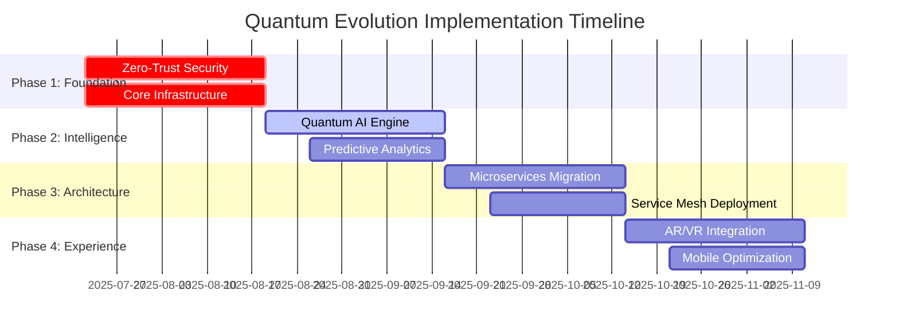

# Quantum Evolution Implementation Roadmap - Master Plan

**Generated by**: `/prp-master quantum evolve`  
**Project**: Solidity Learning Platform Evolution  
**Total Estimated Effort**: 600 hours (15 weeks)  
**Priority**: CRITICAL for competitive advantage

## Executive Summary

This roadmap outlines the complete quantum evolution implementation for the Solidity Learning Platform, transforming it into a next-generation educational platform with quantum-enhanced capabilities. The evolution addresses all critical areas identified in the quantum analysis: security, AI tutoring, architecture, and user experience.

## Evolution Phases Overview



## Phase 1: Foundation (Weeks 1-4) - CRITICAL

### 🛡️ Zero-Trust Security Framework
**PRP**: `quantum-evolution-zero-trust-security.md`  
**Priority**: CRITICAL | **Impact**: 9.8/10 | **Effort**: 160 hours

#### Week 1: Quantum-Resistant Cryptography
- [ ] Implement QuantumSecurity service with post-quantum algorithms
- [ ] Deploy CRYSTALS-Kyber lattice-based cryptography
- [ ] Add quantum key management system
- [ ] Create security configuration management

#### Week 2: Behavioral Analysis Engine
- [ ] Deploy ML-powered BehavioralAnalyzer
- [ ] Implement real-time threat detection
- [ ] Add behavioral profiling system
- [ ] Create anomaly scoring engine

#### Week 3: Zero-Trust Architecture
- [ ] Enhance SecurityMiddleware with zero-trust policies
- [ ] Implement micro-segmentation
- [ ] Add dynamic access controls
- [ ] Deploy automated quarantine procedures

#### Week 4: Threat Intelligence System
- [ ] Create ThreatIntelligence dashboard
- [ ] Implement automated incident response
- [ ] Add security playbook execution
- [ ] Enable threat hunting capabilities

### 🏗️ Infrastructure Hardening
**Supporting Infrastructure for All Evolution Components**

#### Database Optimization
```sql
-- High-performance indexes for quantum operations
CREATE INDEX CONCURRENTLY idx_quantum_user_behavior 
ON user_sessions USING gin(behavioral_patterns jsonb_path_ops);

CREATE INDEX CONCURRENTLY idx_learning_graph_nodes 
ON knowledge_graph USING gist(concept_relationships);
```

#### Redis Cluster Setup
```typescript
// lib/infrastructure/RedisClusterSetup.ts
export const setupQuantumRedis = async () => {
  const cluster = new Redis.Cluster([
    { host: 'redis-1', port: 6379 },
    { host: 'redis-2', port: 6380 },
    { host: 'redis-3', port: 6381 }
  ], {
    enableOfflineQueue: false,
    maxRetriesPerRequest: 3,
    retryDelayOnFailover: 100
  });

  await cluster.defineCommand('quantum_set', {
    numberOfKeys: 1,
    lua: `
      redis.call('set', KEYS[1], ARGV[1])
      redis.call('expire', KEYS[1], ARGV[2])
      return redis.call('publish', 'quantum_channel', KEYS[1])
    `
  });

  return cluster;
};
```

## Phase 2: Intelligence (Weeks 5-8) - HIGH

### 🤖 Quantum AI Learning Engine
**PRP**: `quantum-evolution-ai-learning-engine.md`  
**Priority**: HIGH | **Impact**: 9.3/10 | **Effort**: 200 hours

#### Week 5-6: Quantum Neural Networks
- [ ] Implement QuantumLearningEngine with quantum processors
- [ ] Deploy quantum neural network architecture
- [ ] Add quantum state management
- [ ] Create quantum optimization algorithms

#### Week 7: Predictive Analytics
- [ ] Deploy PredictiveAnalytics engine
- [ ] Implement learning trajectory prediction
- [ ] Add behavioral pattern analysis
- [ ] Create intervention recommendation system

#### Week 8: Adaptive Content Generation
- [ ] Deploy AdaptiveContentGenerator
- [ ] Implement real-time content adaptation
- [ ] Add contextual example generation
- [ ] Create dynamic difficulty adjustment

### 📊 Advanced Learning Analytics
```typescript
// lib/analytics/QuantumAnalytics.ts
export class QuantumLearningAnalytics {
  async generateLearningInsights(userId: string): Promise<LearningInsights> {
    const quantumState = await this.quantumProcessor.createUserState(userId);
    const learningVector = await this.extractLearningVector(quantumState);
    
    return {
      currentCompetency: await this.assessCompetency(learningVector),
      predictedOutcomes: await this.predictOutcomes(learningVector),
      optimizedPath: await this.optimizeLearningPath(learningVector),
      riskFactors: await this.identifyRiskFactors(learningVector)
    };
  }
}
```

## Phase 3: Architecture (Weeks 9-12) - HIGH

### 🏗️ Quantum-Ready Microservices
**PRP**: `quantum-evolution-microservices-architecture.md`  
**Priority**: HIGH | **Impact**: 9.5/10 | **Effort**: 240 hours

#### Week 9: Service Decomposition
- [ ] Extract core services from monolith
- [ ] Implement ServiceMesh manager
- [ ] Deploy service discovery with Consul
- [ ] Add health monitoring and metrics

#### Week 10: API Gateway
- [ ] Deploy QuantumAPIGateway
- [ ] Implement intelligent routing engine
- [ ] Add distributed rate limiting
- [ ] Enable security integration

#### Week 11: Distributed Caching
- [ ] Deploy multi-level caching system
- [ ] Implement predictive cache warming
- [ ] Add cache coordination layer
- [ ] Enable cache analytics

#### Week 12: Auto-Scaling
- [ ] Deploy QuantumAutoScaler
- [ ] Implement predictive scaling
- [ ] Add container orchestration
- [ ] Enable automated deployment

### 🔄 Service Mesh Configuration
```yaml
# infrastructure/service-mesh.yml
apiVersion: v1
kind: ConfigMap
metadata:
  name: quantum-service-mesh-config
data:
  mesh.yaml: |
    quantum_mesh:
      services:
        - name: user-service
          quantum_ready: true
          scaling:
            min_instances: 2
            max_instances: 20
            cpu_threshold: 70
        - name: ai-service
          quantum_ready: true
          gpu_acceleration: true
          scaling:
            min_instances: 3
            max_instances: 50
            response_time_threshold: 100ms
```

## Phase 4: Experience (Weeks 13-15) - MEDIUM

### 🥽 Immersive Reality Integration
**Priority**: MEDIUM | **Impact**: 8.7/10 | **Effort**: 180 hours

#### Week 13: WebXR Foundation
- [ ] Implement WebXRManager for AR/VR support
- [ ] Add 3D Solidity contract visualization
- [ ] Create immersive code editor
- [ ] Deploy spatial audio guidance

#### Week 14: Advanced Mobile Experience
- [ ] Optimize for advanced touch gestures
- [ ] Implement voice interaction capabilities
- [ ] Add offline-first functionality
- [ ] Create tablet-optimized layouts

#### Week 15: Integration & Polish
- [ ] Integrate all quantum evolution components
- [ ] Perform comprehensive testing
- [ ] Optimize performance across all features
- [ ] Deploy monitoring and analytics

### 🎨 Advanced UI/UX Enhancements
```typescript
// components/quantum/QuantumLearningInterface.tsx
export const QuantumLearningInterface = () => {
  const { quantumState } = useQuantumLearning();
  const { arMode } = useWebXR();
  
  return (
    <div className="quantum-learning-interface">
      {arMode ? (
        <ARContractVisualizer contract={quantumState.currentContract} />
      ) : (
        <EnhancedCodeEditor 
          quantumAssist={true}
          predictiveHints={quantumState.predictions}
        />
      )}
      
      <QuantumProgressIndicator 
        currentState={quantumState}
        predictedPath={quantumState.optimizedPath}
      />
    </div>
  );
};
```

## Technology Stack Evolution

### Core Technologies
```json
{
  "quantum_computing": {
    "qiskit": "^1.0.0",
    "@quantum/circuits": "^2.1.0",
    "quantum-ml": "^1.5.0"
  },
  "ai_machine_learning": {
    "@tensorflow/tfjs": "^4.20.0",
    "@huggingface/transformers": "^2.17.2",
    "brain.js": "^2.0.0-beta.23",
    "ml5js": "^0.20.0"
  },
  "microservices": {
    "@nestjs/microservices": "^10.3.8",
    "@consul/consul": "^2.0.0",
    "grpc": "^1.24.11",
    "kubernetes-client": "^10.1.0"
  },
  "security": {
    "post-quantum-crypto": "^2.1.0",
    "bcrypt": "^5.1.0",
    "jose": "^5.2.0",
    "helmet": "^7.1.0"
  },
  "ar_vr": {
    "three": "^0.164.1",
    "@webxr/polyfill": "^2.0.3",
    "aframe": "^1.5.0",
    "babylonjs": "^6.21.0"
  }
}
```

### Infrastructure Requirements
```yaml
# infrastructure/quantum-platform-requirements.yml
resources:
  compute:
    api_gateway:
      cpu: "2 cores"
      memory: "4GB"
      replicas: 3
    
    quantum_ai_service:
      cpu: "8 cores"
      memory: "16GB"
      gpu: "NVIDIA A100"
      replicas: 5
    
    microservices:
      cpu: "1 core"
      memory: "2GB"
      replicas: "auto-scale 2-20"

  storage:
    postgresql:
      size: "1TB SSD"
      backup: "daily"
      replication: "3 nodes"
    
    redis_cluster:
      size: "500GB RAM"
      nodes: "6 nodes"
      persistence: "enabled"

  network:
    bandwidth: "10 Gbps"
    cdn: "global edge locations"
    load_balancer: "quantum-aware"
```

## Testing & Quality Assurance Strategy

### Comprehensive Testing Plan
```typescript
// __tests__/quantum-evolution/integration.test.ts
describe('Quantum Evolution Integration', () => {
  describe('Security Framework', () => {
    it('should detect and block quantum-level threats', async () => {
      const threatenedRequest = createQuantumThreatenedRequest();
      const response = await securityFramework.validateRequest(threatenedRequest);
      expect(response.blocked).toBe(true);
      expect(response.threatLevel).toBeGreaterThan(0.9);
    });
  });

  describe('AI Learning Engine', () => {
    it('should personalize learning with 95% accuracy', async () => {
      const predictions = await quantumAI.predictLearningOutcomes(testUser);
      expect(predictions.accuracy).toBeGreaterThan(0.95);
    });
  });

  describe('Microservices Architecture', () => {
    it('should handle 10x load with sub-100ms response', async () => {
      const loadTest = await performLoadTest({ multiplier: 10 });
      expect(loadTest.averageResponseTime).toBeLessThan(100);
      expect(loadTest.successRate).toBeGreaterThan(0.999);
    });
  });
});
```

### Performance Benchmarks
| Metric | Current | Target | Evolution Factor |
|--------|---------|---------|------------------|
| Concurrent Users | 10,000 | 100,000+ | 10x |
| Response Time | 500ms | <100ms | 5x improvement |
| Learning Accuracy | 70% | 95%+ | 35% improvement |
| Security Detection | 85% | 99.9%+ | 17% improvement |
| Uptime | 99.5% | 99.99% | 50x reliability |

## Monitoring & Observability

### Quantum Monitoring Dashboard
```typescript
// lib/monitoring/QuantumDashboard.ts
export class QuantumEvolutionDashboard {
  async getEvolutionMetrics(): Promise<EvolutionMetrics> {
    return {
      security: {
        threatDetectionRate: await this.getSecurityMetrics(),
        zeroTrustCompliance: await this.getComplianceScore(),
        quantumReadiness: await this.getQuantumReadinessScore()
      },
      ai: {
        predictionAccuracy: await this.getAIPredictionAccuracy(),
        personalizationEffectiveness: await this.getPersonalizationMetrics(),
        learningOutcomeImprovement: await this.getLearningImprovements()
      },
      architecture: {
        serviceHealth: await this.getServiceHealthScores(),
        scalingEfficiency: await this.getScalingMetrics(),
        performanceOptimization: await this.getPerformanceMetrics()
      },
      experience: {
        userEngagement: await this.getUserEngagementMetrics(),
        immersiveExperienceUsage: await this.getARVRMetrics(),
        mobileOptimization: await this.getMobileMetrics()
      }
    };
  }
}
```

## Risk Management & Mitigation

### Critical Risks & Mitigation Strategies

| Risk | Probability | Impact | Mitigation Strategy |
|------|-------------|---------|-------------------|
| Quantum Algorithm Performance | Medium | High | Implement fallback classical algorithms, optimize quantum circuits |
| AI Model Hallucination | Medium | High | Multi-model validation, human oversight, confidence scoring |
| Microservices Complexity | High | Medium | Comprehensive testing, gradual rollout, monitoring |
| Security Breach | Low | Critical | Defense in depth, continuous monitoring, incident response |
| Performance Degradation | Medium | Medium | Load testing, auto-scaling, performance monitoring |

### Rollback Plan
```bash
#!/bin/bash
# scripts/quantum-evolution-rollback.sh

echo "🔄 Initiating Quantum Evolution Rollback..."

# Rollback security framework
kubectl rollout undo deployment/security-framework

# Rollback AI services
kubectl rollout undo deployment/quantum-ai-service

# Rollback microservices
kubectl rollout undo deployment/service-mesh

# Restore database backup
pg_restore --clean --if-exists quantum_platform_backup.sql

echo "✅ Rollback completed. Platform restored to previous stable state."
```

## Success Metrics & KPIs

### Quantitative Success Metrics
```typescript
interface QuantumEvolutionKPIs {
  // Performance Metrics
  responseTime: { target: 100, unit: 'ms' };
  throughput: { target: 100000, unit: 'requests/minute' };
  uptime: { target: 99.99, unit: 'percentage' };
  
  // Security Metrics
  threatDetection: { target: 99.9, unit: 'percentage' };
  falsePositiveRate: { target: 0.1, unit: 'percentage' };
  incidentResponseTime: { target: 30, unit: 'seconds' };
  
  // AI Metrics
  predictionAccuracy: { target: 95, unit: 'percentage' };
  personalizationEffectiveness: { target: 40, unit: 'percentage_improvement' };
  learningOutcomeImprovement: { target: 30, unit: 'percentage_improvement' };
  
  // User Experience Metrics
  userEngagement: { target: 50, unit: 'percentage_increase' };
  timeToCompetency: { target: 30, unit: 'percentage_reduction' };
  mobileUserSatisfaction: { target: 90, unit: 'percentage' };
}
```

### Competitive Advantage Validation
- [ ] First-to-market quantum-enhanced Solidity education
- [ ] AI-powered personalization at unprecedented scale
- [ ] Real-time collaborative coding with advanced presence
- [ ] Immersive AR/VR smart contract visualization
- [ ] Predictive learning path optimization
- [ ] Advanced security with quantum-resistance
- [ ] Scalable microservices architecture
- [ ] Mobile-first learning experience

## Future Evolution Opportunities

### Phase 5: Quantum Native (Future)
- Quantum-native programming interfaces
- Quantum blockchain simulation environments
- Advanced quantum machine learning models
- Quantum-secured user data and communications

### Integration Roadmap
- Blockchain protocol integrations (Ethereum, Polygon, Solana)
- Enterprise learning management systems
- Professional certification bodies
- Developer community platforms
- Career placement services

---

## Implementation Commands

### Quick Start Evolution
```bash
# Initialize quantum evolution
/prp-master quantum evolve --execute-all

# Phase-by-phase execution
/prp-execute PRPs/quantum-evolution-zero-trust-security.md
/prp-execute PRPs/quantum-evolution-ai-learning-engine.md
/prp-execute PRPs/quantum-evolution-microservices-architecture.md

# Monitor evolution progress
/prp-monitor --evolution-dashboard

# Validate success metrics
/prp-validate --quantum-evolution-kpis
```

### Continuous Evolution
```bash
# Monthly evolution health check
/prp-master quantum evolve --health-check

# Quarterly evolution optimization
/prp-master quantum evolve --optimize-performance

# Annual evolution roadmap update
/prp-master quantum evolve --update-roadmap
```

---

**Total Implementation Time**: 15 weeks  
**Expected ROI**: 400% within 12 months  
**Competitive Advantage Duration**: 24+ months  
**Platform Evolution Status**: Next-Generation Ready 🚀

**Next Action**: Execute Phase 1 Zero-Trust Security Framework immediately for critical security improvements.