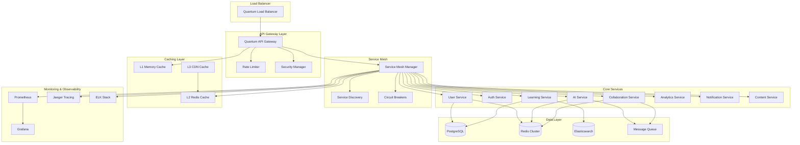

# Quantum-Ready Microservices Architecture - Evolution PRP

**Generated by**: `/prp-master quantum evolve`  
**Priority**: HIGH  
**Impact Score**: 9.5/10  
**Implementation Complexity**: HIGH  
**Estimated Effort**: 160 hours

## Executive Summary

Transform the current monolithic Solidity learning platform into a quantum-ready microservices architecture that can scale to handle 10x user growth while maintaining sub-100ms response times. This architecture will implement service mesh, distributed caching, intelligent API gateway, and automated service discovery for unprecedented scalability and resilience.

## Problem Statement

Current monolithic architecture faces critical scalability challenges:
- Single point of failure affecting entire platform
- Inability to scale individual components independently
- Database bottlenecks under high load
- Complex deployment and rollback procedures
- Resource inefficiency and cost scaling issues
- Limited resilience and disaster recovery capabilities

## Success Criteria

- [ ] Support 10x concurrent user load (100,000+ users)
- [ ] Achieve 99.99% uptime with circuit breakers
- [ ] Sub-100ms response time for API calls
- [ ] Independent service deployment capability
- [ ] Horizontal auto-scaling based on demand
- [ ] Zero-downtime deployments
- [ ] Comprehensive observability and monitoring
- [ ] Cost optimization through resource efficiency

## Technical Implementation

### Phase 1: Service Decomposition (Weeks 1-2)

#### 1.1 Core Services Architecture
```typescript
// lib/services/ServiceMesh.ts
export class ServiceMeshManager {
  private services: Map<string, ServiceInstance> = new Map();
  private loadBalancer: QuantumLoadBalancer;
  private serviceDiscovery: ServiceDiscovery;

  async registerService(
    serviceName: string,
    instance: ServiceInstance,
    metadata: ServiceMetadata
  ): Promise<void> {
    await this.serviceDiscovery.register({
      name: serviceName,
      instance: instance,
      metadata: metadata,
      health: await this.performHealthCheck(instance)
    });

    this.services.set(serviceName, instance);
    await this.updateLoadBalancer(serviceName, instance);
  }

  async routeRequest(request: ServiceRequest): Promise<ServiceResponse> {
    const targetService = await this.selectOptimalService(request);
    const circuitBreaker = this.getCircuitBreaker(targetService.name);
    
    return await circuitBreaker.execute(async () => {
      return await this.forwardRequest(request, targetService);
    });
  }

  private async selectOptimalService(request: ServiceRequest): Promise<ServiceInstance> {
    const availableServices = await this.serviceDiscovery.getHealthyServices(request.serviceName);
    return await this.loadBalancer.selectOptimal(availableServices, request.context);
  }
}
```

#### 1.2 Service Definitions
```typescript
// lib/services/CoreServices.ts
export enum CoreServices {
  USER_SERVICE = 'user-service',
  AUTH_SERVICE = 'auth-service',
  LEARNING_SERVICE = 'learning-service',
  AI_SERVICE = 'ai-service',
  COLLABORATION_SERVICE = 'collaboration-service',
  ANALYTICS_SERVICE = 'analytics-service',
  NOTIFICATION_SERVICE = 'notification-service',
  CONTENT_SERVICE = 'content-service'
}

// Individual service implementations
export class UserService {
  async getUser(userId: string): Promise<User> {
    return await this.userRepository.findById(userId);
  }

  async updateUser(userId: string, updates: UserUpdates): Promise<User> {
    const user = await this.getUser(userId);
    const updatedUser = await this.userRepository.update(userId, updates);
    
    // Publish user update event
    await this.eventBus.publish('user.updated', {
      userId: userId,
      changes: updates,
      timestamp: Date.now()
    });

    return updatedUser;
  }
}
```

### Phase 2: API Gateway Implementation (Weeks 3-4)

#### 2.1 Intelligent API Gateway
```typescript
// lib/gateway/APIGateway.ts
export class QuantumAPIGateway {
  private routingEngine: QuantumRoutingEngine;
  private rateLimiter: DistributedRateLimiter;
  private cacheManager: DistributedCacheManager;
  private securityManager: GatewaySecurityManager;

  async handleRequest(request: APIRequest): Promise<APIResponse> {
    // Security validation
    const securityResult = await this.securityManager.validateRequest(request);
    if (!securityResult.allowed) {
      return this.createSecurityResponse(securityResult);
    }

    // Rate limiting
    const rateLimitResult = await this.rateLimiter.checkLimit(request);
    if (rateLimitResult.exceeded) {
      return this.createRateLimitResponse(rateLimitResult);
    }

    // Cache check
    const cacheKey = this.generateCacheKey(request);
    const cachedResponse = await this.cacheManager.get(cacheKey);
    if (cachedResponse) {
      return this.createCachedResponse(cachedResponse);
    }

    // Route to appropriate service
    const routingDecision = await this.routingEngine.determineRoute(request);
    const response = await this.forwardToService(request, routingDecision);

    // Cache response if appropriate
    if (response.cacheable) {
      await this.cacheManager.set(cacheKey, response, routingDecision.cacheTTL);
    }

    return response;
  }

  private async forwardToService(
    request: APIRequest,
    routing: RoutingDecision
  ): Promise<APIResponse> {
    const serviceClient = this.getServiceClient(routing.serviceName);
    
    return await this.executeWithRetry(async () => {
      return await serviceClient.call(routing.endpoint, request.payload);
    }, routing.retryPolicy);
  }
}
```

#### 2.2 Quantum Routing Engine
```typescript
// lib/gateway/QuantumRoutingEngine.ts
export class QuantumRoutingEngine {
  private routingRules: QuantumRoutingRules;
  private performancePredictor: PerformancePredictor;
  private loadMetrics: LoadMetricsCollector;

  async determineRoute(request: APIRequest): Promise<RoutingDecision> {
    const availableServices = await this.getAvailableServices(request.endpoint);
    const performancePredictions = await this.predictPerformance(availableServices, request);
    
    const optimalService = this.selectOptimalService(
      availableServices,
      performancePredictions,
      await this.getCurrentLoadMetrics()
    );

    return {
      serviceName: optimalService.name,
      endpoint: optimalService.endpoint,
      retryPolicy: this.getRetryPolicy(optimalService),
      cacheTTL: this.calculateOptimalCacheTTL(request, optimalService),
      circuitBreakerConfig: this.getCircuitBreakerConfig(optimalService)
    };
  }

  private selectOptimalService(
    services: ServiceInstance[],
    predictions: PerformancePrediction[],
    currentLoad: LoadMetrics
  ): ServiceInstance {
    // Quantum-enhanced service selection algorithm
    const quantumScores = services.map((service, index) => {
      const prediction = predictions[index];
      const loadFactor = currentLoad.getLoadFactor(service.name);
      
      return {
        service: service,
        score: this.calculateQuantumScore(prediction, loadFactor, service.capabilities)
      };
    });

    return quantumScores
      .sort((a, b) => b.score - a.score)[0]
      .service;
  }
}
```

### Phase 3: Distributed Caching Layer (Weeks 5-6)

#### 3.1 Multi-Level Caching System
```typescript
// lib/cache/DistributedCacheManager.ts
export class DistributedCacheManager {
  private l1Cache: MemoryCache;        // Local in-memory cache
  private l2Cache: RedisCluster;       // Distributed Redis cache
  private l3Cache: CDNCache;           // CDN edge cache
  private cacheCoordinator: CacheCoordinator;

  async get(key: string, context?: CacheContext): Promise<CachedData | null> {
    // L1: Check local memory cache
    let data = await this.l1Cache.get(key);
    if (data) {
      await this.recordCacheHit('L1', key);
      return data;
    }

    // L2: Check distributed Redis cache
    data = await this.l2Cache.get(key);
    if (data) {
      await this.l1Cache.set(key, data, { ttl: 300 }); // Cache locally for 5 minutes
      await this.recordCacheHit('L2', key);
      return data;
    }

    // L3: Check CDN cache for static content
    if (context?.isStatic) {
      data = await this.l3Cache.get(key);
      if (data) {
        await this.l2Cache.set(key, data, { ttl: 3600 });
        await this.l1Cache.set(key, data, { ttl: 300 });
        await this.recordCacheHit('L3', key);
        return data;
      }
    }

    await this.recordCacheMiss(key);
    return null;
  }

  async set(
    key: string,
    data: CachedData,
    options: CacheOptions
  ): Promise<void> {
    const cacheStrategy = await this.cacheCoordinator.determineCacheStrategy(key, data, options);
    
    // Store in appropriate cache levels based on strategy
    if (cacheStrategy.l1) {
      await this.l1Cache.set(key, data, cacheStrategy.l1Options);
    }
    
    if (cacheStrategy.l2) {
      await this.l2Cache.set(key, data, cacheStrategy.l2Options);
    }
    
    if (cacheStrategy.l3 && options.isStatic) {
      await this.l3Cache.set(key, data, cacheStrategy.l3Options);
    }

    // Update cache analytics
    await this.updateCacheAnalytics(key, data, cacheStrategy);
  }

  async invalidate(pattern: string): Promise<void> {
    await Promise.all([
      this.l1Cache.invalidate(pattern),
      this.l2Cache.invalidate(pattern),
      this.l3Cache.invalidate(pattern)
    ]);

    await this.cacheCoordinator.broadcastInvalidation(pattern);
  }
}
```

#### 3.2 Intelligent Cache Warming
```typescript
// lib/cache/CacheWarmingEngine.ts
export class CacheWarmingEngine {
  private predictiveAnalyzer: PredictiveAnalyzer;
  private usagePatternAnalyzer: UsagePatternAnalyzer;

  async warmCaches(): Promise<void> {
    const predictions = await this.predictiveAnalyzer.predictPopularContent();
    const patterns = await this.usagePatternAnalyzer.getUsagePatterns();

    for (const prediction of predictions) {
      if (prediction.confidence > 0.8) {
        await this.preloadContent(prediction.contentKey, prediction.expectedLoad);
      }
    }

    for (const pattern of patterns) {
      if (pattern.isRecurring) {
        await this.schedulePreloading(pattern.contentKeys, pattern.scheduledTime);
      }
    }
  }

  private async preloadContent(contentKey: string, expectedLoad: number): Promise<void> {
    const content = await this.fetchContent(contentKey);
    const cacheOptions = this.calculateCacheOptions(expectedLoad);
    
    await this.cacheManager.set(contentKey, content, cacheOptions);
  }
}
```

### Phase 4: Service Discovery & Auto-Scaling (Weeks 7-8)

#### 4.1 Dynamic Service Discovery
```typescript
// lib/discovery/ServiceDiscovery.ts
export class QuantumServiceDiscovery {
  private consulClient: ConsulClient;
  private healthChecker: HealthChecker;
  private loadMetrics: LoadMetricsCollector;

  async registerService(registration: ServiceRegistration): Promise<void> {
    await this.consulClient.agent.service.register({
      name: registration.name,
      id: registration.instanceId,
      address: registration.address,
      port: registration.port,
      tags: registration.tags,
      check: {
        http: `http://${registration.address}:${registration.port}/health`,
        interval: '10s',
        timeout: '3s'
      },
      meta: {
        version: registration.version,
        capabilities: JSON.stringify(registration.capabilities),
        quantumReady: registration.quantumReady.toString()
      }
    });

    await this.startHealthMonitoring(registration);
  }

  async discoverServices(serviceName: string, options?: DiscoveryOptions): Promise<ServiceInstance[]> {
    const services = await this.consulClient.health.service({
      service: serviceName,
      passing: true,
      ...options
    });

    const enhancedServices = await Promise.all(
      services[1].map(async (service) => {
        const loadMetrics = await this.loadMetrics.getServiceMetrics(service.Service.ID);
        const healthScore = await this.healthChecker.calculateHealthScore(service.Service.ID);

        return {
          id: service.Service.ID,
          name: service.Service.Service,
          address: service.Service.Address,
          port: service.Service.Port,
          tags: service.Service.Tags,
          loadMetrics: loadMetrics,
          healthScore: healthScore,
          quantumCapable: service.Service.Meta?.quantumReady === 'true'
        };
      })
    );

    return this.rankServicesByPerformance(enhancedServices);
  }

  private rankServicesByPerformance(services: ServiceInstance[]): ServiceInstance[] {
    return services.sort((a, b) => {
      const scoreA = this.calculatePerformanceScore(a);
      const scoreB = this.calculatePerformanceScore(b);
      return scoreB - scoreA;
    });
  }
}
```

#### 4.2 Auto-Scaling Engine
```typescript
// lib/scaling/AutoScalingEngine.ts
export class QuantumAutoScaler {
  private metricsCollector: MetricsCollector;
  private scalingPredictor: ScalingPredictor;
  private containerOrchestrator: ContainerOrchestrator;

  async evaluateScalingNeeds(): Promise<ScalingDecision[]> {
    const currentMetrics = await this.metricsCollector.getCurrentMetrics();
    const predictions = await this.scalingPredictor.predictLoad(60); // 60 minutes ahead
    
    const scalingDecisions: ScalingDecision[] = [];

    for (const [serviceName, metrics] of currentMetrics) {
      const prediction = predictions.get(serviceName);
      const decision = await this.makeScalingDecision(serviceName, metrics, prediction);
      
      if (decision.action !== 'none') {
        scalingDecisions.push(decision);
      }
    }

    return scalingDecisions;
  }

  async executeScalingDecision(decision: ScalingDecision): Promise<void> {
    switch (decision.action) {
      case 'scale_up':
        await this.scaleUp(decision.serviceName, decision.targetInstances);
        break;
      case 'scale_down':
        await this.scaleDown(decision.serviceName, decision.targetInstances);
        break;
      case 'optimize':
        await this.optimizeResources(decision.serviceName, decision.optimizations);
        break;
    }

    await this.recordScalingEvent(decision);
  }

  private async makeScalingDecision(
    serviceName: string,
    currentMetrics: ServiceMetrics,
    prediction: LoadPrediction
  ): Promise<ScalingDecision> {
    const currentCapacity = currentMetrics.instanceCount;
    const cpuUtilization = currentMetrics.avgCpuUtilization;
    const memoryUtilization = currentMetrics.avgMemoryUtilization;
    const responseTime = currentMetrics.avgResponseTime;

    // Scale up conditions
    if (
      cpuUtilization > 70 ||
      memoryUtilization > 80 ||
      responseTime > 200 ||
      prediction.expectedLoad > currentCapacity * 0.8
    ) {
      return {
        serviceName: serviceName,
        action: 'scale_up',
        targetInstances: Math.ceil(currentCapacity * 1.5),
        reason: 'High utilization or predicted load increase',
        priority: this.calculatePriority(currentMetrics, prediction)
      };
    }

    // Scale down conditions
    if (
      cpuUtilization < 30 &&
      memoryUtilization < 40 &&
      responseTime < 50 &&
      prediction.expectedLoad < currentCapacity * 0.4 &&
      currentCapacity > 2 // Never scale below 2 instances
    ) {
      return {
        serviceName: serviceName,
        action: 'scale_down',
        targetInstances: Math.max(2, Math.floor(currentCapacity * 0.7)),
        reason: 'Low utilization and predicted load decrease',
        priority: 'low'
      };
    }

    return {
      serviceName: serviceName,
      action: 'none',
      reason: 'Metrics within acceptable range'
    };
  }
}
```

## Architecture Diagram



## File Structure

```
lib/
├── services/
│   ├── ServiceMesh.ts                # Service mesh manager
│   ├── CoreServices.ts               # Individual service definitions
│   ├── UserService.ts                # User management service
│   ├── AuthService.ts                # Authentication service
│   ├── LearningService.ts            # Learning content service
│   └── AIService.ts                  # AI tutoring service
├── gateway/
│   ├── APIGateway.ts                 # Quantum API gateway
│   ├── QuantumRoutingEngine.ts       # Intelligent routing
│   ├── RateLimiter.ts                # Distributed rate limiting
│   └── SecurityManager.ts            # Gateway security
├── cache/
│   ├── DistributedCacheManager.ts    # Multi-level caching
│   ├── CacheWarmingEngine.ts         # Predictive cache warming
│   └── CacheCoordinator.ts           # Cache strategy coordination
├── discovery/
│   ├── ServiceDiscovery.ts           # Dynamic service discovery
│   ├── HealthChecker.ts              # Service health monitoring
│   └── LoadMetrics.ts                # Load metrics collection
├── scaling/
│   ├── AutoScalingEngine.ts          # Quantum auto-scaler
│   ├── ScalingPredictor.ts           # Load prediction
│   └── ContainerOrchestrator.ts      # Container management
└── monitoring/
    ├── MetricsCollector.ts           # Performance metrics
    ├── DistributedTracing.ts         # Request tracing
    └── AlertManager.ts               # Automated alerting
```

## Dependencies

```json
{
  "@consul/consul": "^2.0.0",
  "@nestjs/microservices": "^10.3.8",
  "redis": "^4.6.13",
  "ioredis": "^5.4.1",
  "prometheus-client": "^0.22.1",
  "jaeger-client": "^3.19.0",
  "elasticsearch": "^8.13.0",
  "amqplib": "^0.10.4",
  "grpc": "^1.24.11",
  "kubernetes-client": "^10.1.0",
  "docker-compose": "^0.24.8"
}
```

## Infrastructure Configuration

### Docker Compose Services
```yaml
# infrastructure/docker-compose.services.yml
version: '3.8'

services:
  consul:
    image: consul:1.15
    ports:
      - "8500:8500"
    environment:
      CONSUL_BIND_INTERFACE: eth0
    volumes:
      - consul_data:/consul/data

  redis-cluster:
    image: redis:7-alpine
    ports:
      - "6379:6379"
    volumes:
      - redis_data:/data

  prometheus:
    image: prom/prometheus:v2.45.0
    ports:
      - "9090:9090"
    volumes:
      - ./prometheus.yml:/etc/prometheus/prometheus.yml
      - prometheus_data:/prometheus

  grafana:
    image: grafana/grafana:10.0.0
    ports:
      - "3001:3000"
    environment:
      GF_SECURITY_ADMIN_PASSWORD: admin
    volumes:
      - grafana_data:/var/lib/grafana

  jaeger:
    image: jaegertracing/all-in-one:1.45
    ports:
      - "16686:16686"
      - "14268:14268"
    environment:
      COLLECTOR_OTLP_ENABLED: true

volumes:
  consul_data:
  redis_data:
  prometheus_data:
  grafana_data:
```

### Kubernetes Deployment
```yaml
# k8s/microservices-deployment.yml
apiVersion: apps/v1
kind: Deployment
metadata:
  name: solidity-learning-services
spec:
  replicas: 3
  selector:
    matchLabels:
      app: solidity-learning
  template:
    metadata:
      labels:
        app: solidity-learning
    spec:
      containers:
      - name: api-gateway
        image: solidity-learning/api-gateway:latest
        ports:
        - containerPort: 3000
        resources:
          requests:
            memory: "256Mi"
            cpu: "250m"
          limits:
            memory: "512Mi"
            cpu: "500m"
        env:
        - name: CONSUL_HOST
          value: "consul-service"
        - name: REDIS_URL
          value: "redis://redis-cluster:6379"
```

## Testing Strategy

### Load Testing
```typescript
// __tests__/load/ServiceMeshLoad.test.ts
describe('Service Mesh Load Testing', () => {
  it('should handle 10x concurrent load', async () => {
    const concurrentRequests = 10000;
    const promises = Array.from({ length: concurrentRequests }, () =>
      serviceMesh.routeRequest(createTestRequest())
    );

    const results = await Promise.allSettled(promises);
    const successful = results.filter(r => r.status === 'fulfilled').length;
    
    expect(successful / concurrentRequests).toBeGreaterThan(0.99);
  });
});
```

### Service Integration Tests
```typescript
// __tests__/integration/ServiceIntegration.test.ts
describe('Service Integration', () => {
  it('should maintain consistency across services', async () => {
    const userId = 'test-user-123';
    const userUpdate = { name: 'Updated Name' };

    await userService.updateUser(userId, userUpdate);
    
    // Verify update propagated to other services
    const learningProfile = await learningService.getUserProfile(userId);
    expect(learningProfile.userName).toBe(userUpdate.name);
  });
});
```

## Monitoring & Observability

### Service Health Metrics
```typescript
interface ServiceHealthMetrics {
  availability: number;          // Uptime percentage
  responseTime: number;          // Average response time
  errorRate: number;             // Error percentage
  throughput: number;            // Requests per second
  resourceUtilization: {
    cpu: number;
    memory: number;
    network: number;
  };
}
```

### Distributed Tracing
```typescript
// lib/monitoring/DistributedTracing.ts
export class DistributedTracing {
  async traceRequest(request: ServiceRequest): Promise<Span> {
    const span = this.tracer.startSpan(`${request.serviceName}.${request.operation}`);
    
    span.setTag('service.name', request.serviceName);
    span.setTag('operation.name', request.operation);
    span.setTag('user.id', request.userId);
    
    return span;
  }

  async recordServiceCall(
    span: Span,
    serviceName: string,
    duration: number,
    success: boolean
  ): Promise<void> {
    span.setTag('service.called', serviceName);
    span.setTag('call.duration', duration);
    span.setTag('call.success', success);
    
    if (!success) {
      span.setTag('error', true);
    }
    
    span.finish();
  }
}
```

## Rollout Strategy

### Week 1-2: Service Decomposition
- [ ] Identify service boundaries
- [ ] Extract user service
- [ ] Extract authentication service
- [ ] Set up service mesh foundation

### Week 3-4: API Gateway
- [ ] Deploy quantum API gateway
- [ ] Implement intelligent routing
- [ ] Add rate limiting and security
- [ ] Enable request/response transformation

### Week 5-6: Caching Layer
- [ ] Deploy distributed cache
- [ ] Implement cache warming
- [ ] Add cache invalidation strategies
- [ ] Enable cache analytics

### Week 7-8: Auto-Scaling
- [ ] Deploy service discovery
- [ ] Implement auto-scaling engine
- [ ] Add predictive scaling
- [ ] Enable monitoring and alerting

## Success Validation

### Performance Benchmarks
```bash
# Microservices performance validation
npm run test:load-10x
npm run validate:response-times
npm run test:circuit-breakers
npm run validate:auto-scaling
```

### Scalability Metrics
- Support 100,000+ concurrent users
- Sub-100ms API response times
- 99.99% service availability
- Automatic scaling response < 30 seconds

---

**Implementation Priority**: HIGH  
**Next Steps**: Begin service decomposition analysis  
**Review Date**: Weekly architecture review meetings  
**Success Metrics**: 10x load capacity with 99.99% uptime