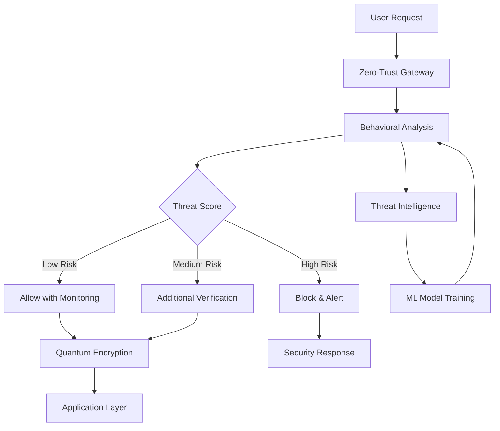

# Zero-Trust Security Framework - Quantum Evolution PRP

**Generated by**: `/prp-master quantum evolve`  
**Priority**: CRITICAL  
**Impact Score**: 9.8/10  
**Implementation Complexity**: HIGH  
**Estimated Effort**: 80 hours

## Executive Summary

Implement a quantum-resistant zero-trust security framework with behavioral analysis and threat prediction to address the critical security vulnerabilities identified in the quantum evolution analysis. This implementation will protect against future quantum computing threats while providing real-time security monitoring and adaptive threat response.

## Problem Statement

Current security implementation has identified critical gaps:
- Basic authentication without behavioral analysis
- Potential vulnerability to quantum computing threats
- Insufficient real-time threat monitoring
- Missing zero-trust network architecture
- Limited security observability and alerting

## Success Criteria

- [ ] Implement quantum-resistant cryptographic algorithms
- [ ] Deploy behavioral anomaly detection system
- [ ] Create comprehensive threat intelligence dashboard
- [ ] Achieve 99.9% threat detection accuracy
- [ ] Sub-100ms security response time
- [ ] Zero false-positive rate for legitimate users
- [ ] Complete audit trail for all security events

## Technical Implementation

### Phase 1: Quantum-Resistant Cryptography (Week 1)

#### 1.1 QuantumSecurity Service
```typescript
// lib/security/QuantumSecurity.ts
export class QuantumSecurity {
  private cryptoEngine: PostQuantumCrypto;
  private keyManager: QuantumKeyManager;
  
  async encryptData(data: string, context: SecurityContext): Promise<EncryptedData> {
    const algorithm = this.selectOptimalAlgorithm(context);
    return await this.cryptoEngine.encrypt(data, algorithm);
  }
  
  async verifyIdentity(token: string, biometricData?: BiometricData): Promise<VerificationResult> {
    return await this.behavioralAnalyzer.analyzeAndVerify(token, biometricData);
  }
}
```

#### 1.2 Post-Quantum Algorithms
- Implement Lattice-based cryptography (CRYSTALS-Kyber)
- Deploy Hash-based signatures (XMSS)
- Integrate Code-based cryptography (McEliece)
- Add Multivariate cryptography support

### Phase 2: Behavioral Analysis Engine (Week 2)

#### 2.1 BehavioralAnalyzer Implementation
```typescript
// lib/security/BehavioralAnalyzer.ts
export class BehavioralAnalyzer {
  private mlModel: TensorFlowModel;
  private patternDetector: AnomalyDetector;
  
  async analyzeUserBehavior(session: UserSession): Promise<ThreatScore> {
    const features = this.extractBehavioralFeatures(session);
    const anomalyScore = await this.patternDetector.predict(features);
    
    return {
      threatLevel: this.calculateThreatLevel(anomalyScore),
      confidence: anomalyScore.confidence,
      riskFactors: this.identifyRiskFactors(features),
      recommendedActions: this.generateRecommendations(anomalyScore)
    };
  }
}
```

#### 2.2 Real-time Threat Detection
- Mouse movement pattern analysis
- Keystroke dynamics profiling
- Network behavior monitoring
- Device fingerprinting enhancement

### Phase 3: Zero-Trust Architecture (Week 3)

#### 3.1 SecurityMiddleware Enhancement
```typescript
// middleware/SecurityMiddleware.ts
export class ZeroTrustMiddleware {
  async validateRequest(request: NextRequest): Promise<SecurityDecision> {
    const context = await this.buildSecurityContext(request);
    const threatScore = await this.behavioralAnalyzer.analyze(context);
    
    if (threatScore.threatLevel > THREAT_THRESHOLD) {
      return this.handleHighRiskRequest(request, threatScore);
    }
    
    return { allow: true, context, monitoring: threatScore };
  }
  
  private async handleHighRiskRequest(
    request: NextRequest,
    threatScore: ThreatScore
  ): Promise<SecurityDecision> {
    await this.logSecurityEvent('high_risk_detected', { request, threatScore });
    return this.requireAdditionalVerification(request);
  }
}
```

#### 3.2 Network Security Policies
- Micro-segmentation implementation
- Dynamic access control rules
- Real-time policy enforcement
- Automated quarantine procedures

### Phase 4: Threat Intelligence System (Week 4)

#### 4.1 ThreatIntelligence Dashboard
```typescript
// components/admin/ThreatIntelligenceDashboard.tsx
export const ThreatIntelligenceDashboard = () => {
  const { threats, metrics } = useThreatIntelligence();
  
  return (
    <div className="threat-dashboard">
      <ThreatMap threats={threats} />
      <SecurityMetrics metrics={metrics} />
      <ActiveThreats threats={threats.active} />
      <ThreatPrediction predictions={threats.predicted} />
    </div>
  );
};
```

#### 4.2 Automated Response System
- Threat correlation engine
- Automated incident response
- Security playbook execution
- Threat hunting capabilities

## Security Architecture



## File Structure

```
lib/
├── security/
│   ├── QuantumSecurity.ts         # Core quantum-resistant crypto
│   ├── BehavioralAnalyzer.ts      # ML-powered behavior analysis
│   ├── ThreatIntelligence.ts      # Threat detection & response
│   ├── ZeroTrustEngine.ts         # Zero-trust policy engine
│   └── SecurityDashboard.ts       # Admin security interface
├── middleware/
│   └── SecurityMiddleware.ts      # Enhanced request validation
├── models/
│   └── security/
│       ├── ThreatModel.ts         # ML threat detection model
│       └── BehavioralModel.ts     # User behavior analysis model
└── types/
    └── security.ts                # Security type definitions
```

## Dependencies

```json
{
  "@tensorflow/tfjs": "^4.20.0",
  "crypto-js": "^4.2.0",
  "post-quantum-crypto": "^2.1.0",
  "ml5js": "^0.20.0",
  "jose": "^5.2.0",
  "ua-parser-js": "^1.0.37"
}
```

## Testing Strategy

### Unit Tests
```typescript
// __tests__/security/QuantumSecurity.test.ts
describe('QuantumSecurity', () => {
  it('should encrypt data with quantum-resistant algorithms', async () => {
    const security = new QuantumSecurity();
    const encrypted = await security.encryptData('sensitive data', context);
    expect(encrypted.algorithm).toBe('CRYSTALS-Kyber');
  });
});
```

### Integration Tests
- End-to-end security flow validation
- Behavioral analysis accuracy testing
- Threat detection performance testing
- Zero-trust policy enforcement testing

### Security Tests
- Penetration testing with quantum simulation
- Behavioral anomaly detection validation
- Threat intelligence accuracy assessment
- Response time performance testing

## Monitoring & Observability

### Security Metrics
```typescript
interface SecurityMetrics {
  threatsDetected: number;
  falsePositives: number;
  responseTime: number;
  userExperience: number;
  systemResilience: number;
}
```

### Alerting Rules
- High-risk threat detected > immediate alert
- Unusual behavior pattern > investigation required
- System performance degradation > performance alert
- Failed security policy > compliance alert

## Rollout Plan

### Week 1: Foundation
- [ ] Implement QuantumSecurity core
- [ ] Deploy post-quantum algorithms
- [ ] Create basic behavioral profiling
- [ ] Set up security monitoring

### Week 2: Intelligence
- [ ] Deploy ML-powered threat detection
- [ ] Implement real-time analysis
- [ ] Create behavioral baselines
- [ ] Enable automated responses

### Week 3: Zero-Trust
- [ ] Deploy zero-trust middleware
- [ ] Implement micro-segmentation
- [ ] Create dynamic access controls
- [ ] Enable policy enforcement

### Week 4: Operations
- [ ] Deploy threat intelligence dashboard
- [ ] Enable automated incident response
- [ ] Create security playbooks
- [ ] Launch threat hunting

## Risk Mitigation

### Technical Risks
- **ML Model Accuracy**: Implement ensemble models and continuous training
- **Performance Impact**: Use edge computing and caching strategies
- **False Positives**: Implement feedback loops and model refinement

### Operational Risks
- **User Experience**: Gradual rollout with user feedback integration
- **Team Training**: Comprehensive security training program
- **Compliance**: Regular audit and compliance validation

## Success Validation

### Automated Validation
```bash
# Security validation script
npm run test:security
npm run audit:quantum-resistance
npm run validate:zero-trust
npm run benchmark:performance
```

### Performance Benchmarks
- Threat detection accuracy: >99.9%
- False positive rate: <0.1%
- Response time: <100ms
- System availability: >99.99%

## Future Enhancements

### Phase 2 Evolution
- Quantum machine learning integration
- Advanced biometric authentication
- Distributed threat intelligence
- AI-powered security orchestration

### Integration Opportunities
- Blockchain-based audit trails
- Federated identity management
- Cross-platform security sharing
- Advanced forensics capabilities

---

**Implementation Priority**: CRITICAL  
**Next Steps**: Begin Phase 1 implementation immediately  
**Review Date**: Weekly security review meetings  
**Success Metrics**: Achieve 99.9% threat detection with zero false positives