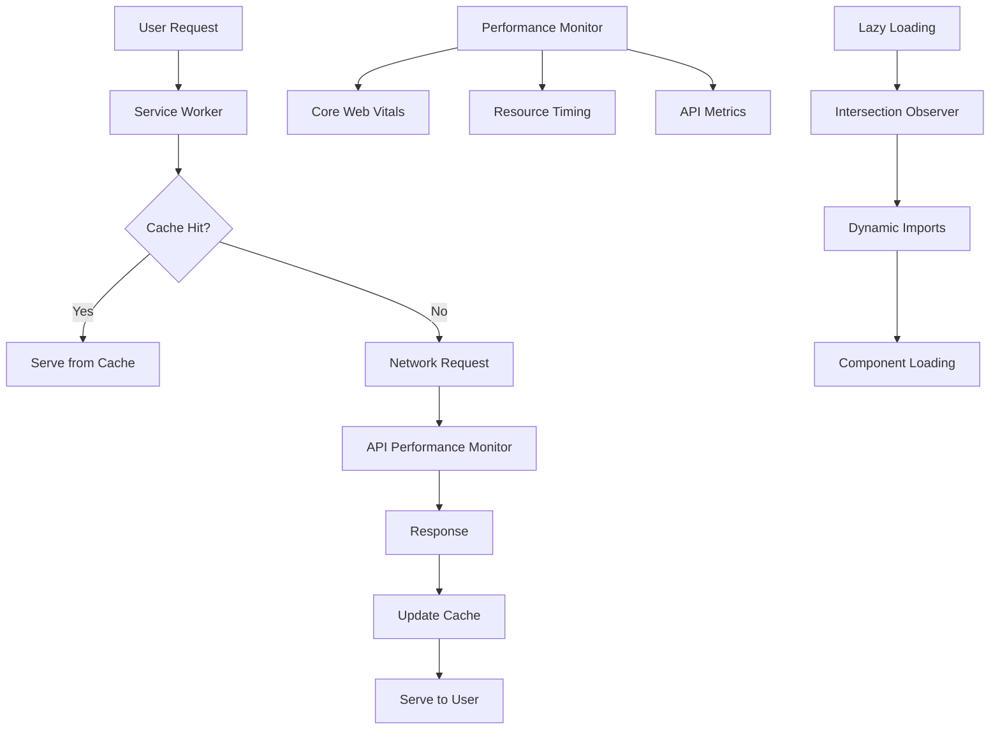

# Performance Architecture

This document outlines the performance optimization architecture of the Solidity Learning Platform.

## 🎯 Performance Goals

- **Page Load Time**: < 200ms for critical paths
- **Core Web Vitals**: LCP < 2.5s, FID < 100ms, CLS < 0.1
- **Bundle Size**: < 400KB initial JavaScript bundle
- **Lighthouse Score**: > 90 for Performance, Accessibility, Best Practices, SEO
- **Offline Support**: Full functionality available offline

## 🏗️ Architecture Overview



## 🚀 Core Performance Features

### 1. Service Worker & Caching

**Implementation**: `/public/sw.js`

```javascript
// Cache strategies
const CACHE_STRATEGIES = {
  CACHE_FIRST: 'cache-first',        // Static assets
  NETWORK_FIRST: 'network-first',    // API calls
  STALE_WHILE_REVALIDATE: 'stale-while-revalidate', // Pages
};

// Cache configuration
const STATIC_CACHE = 'static-v1';
const DYNAMIC_CACHE = 'dynamic-v1';
const API_CACHE = 'api-v1';
```

**Features**:
- Intelligent caching strategies based on resource type
- Background sync for offline actions
- Cache invalidation and updates
- Performance metrics collection

### 2. Lazy Loading & Code Splitting

**Implementation**: `/components/lazy/`

```typescript
// Component lazy loading
const LazyComponent = React.lazy(() => import('./HeavyComponent'));

// Route-based code splitting
const LazyPage = React.lazy(() => import('../pages/LazyPage'));

// Intersection Observer for viewport-based loading
const useLazyLoad = (threshold = 0.1) => {
  const [isVisible, setIsVisible] = useState(false);
  const ref = useRef<HTMLDivElement>(null);

  useEffect(() => {
    const observer = new IntersectionObserver(
      ([entry]) => setIsVisible(entry.isIntersecting),
      { threshold }
    );
    
    if (ref.current) observer.observe(ref.current);
    return () => observer.disconnect();
  }, [threshold]);

  return [ref, isVisible] as const;
};
```

### 3. API Performance Monitoring

**Implementation**: `/lib/monitoring/apiPerformance.ts`

```typescript
interface PerformanceMetric {
  endpoint: string;
  method: string;
  duration: number;
  status: number;
  timestamp: number;
  size?: number;
  cached?: boolean;
  retryCount?: number;
}

class APIPerformanceMonitor {
  private metrics: PerformanceMetric[] = [];
  
  recordMetric(metric: PerformanceMetric) {
    this.metrics.push(metric);
    this.cleanOldMetrics();
  }
  
  getStats(timeWindow = 300000) {
    const cutoff = Date.now() - timeWindow;
    const recentMetrics = this.metrics.filter(m => m.timestamp > cutoff);
    
    return {
      totalRequests: recentMetrics.length,
      averageResponseTime: this.calculateAverage(recentMetrics),
      p95ResponseTime: this.calculatePercentile(recentMetrics, 95),
      p99ResponseTime: this.calculatePercentile(recentMetrics, 99),
      errorRate: this.calculateErrorRate(recentMetrics),
      slowRequestRate: this.calculateSlowRequestRate(recentMetrics),
    };
  }
}
```

### 4. Image Optimization

**Implementation**: `/components/ui/OptimizedImage.tsx`

```typescript
interface OptimizedImageProps {
  src: string;
  alt: string;
  width?: number;
  height?: number;
  priority?: boolean;
  sizes?: string;
}

export const OptimizedImage: React.FC<OptimizedImageProps> = ({
  src,
  alt,
  width,
  height,
  priority = false,
  sizes = '(max-width: 768px) 100vw, (max-width: 1200px) 50vw, 33vw',
}) => {
  return (
    <Image
      src={src}
      alt={alt}
      width={width}
      height={height}
      priority={priority}
      sizes={sizes}
      placeholder="blur"
      blurDataURL="data:image/jpeg;base64,/9j/4AAQSkZJRgABAQAAAQ..."
      style={{
        width: '100%',
        height: 'auto',
      }}
    />
  );
};
```

### 5. CSS Optimization

**Implementation**: `/lib/utils/cssOptimization.ts`

```typescript
// Critical CSS extraction
export function extractCriticalCSS(config: CriticalCSSConfig): string {
  const { selectors, mediaQueries = [], excludeSelectors = [] } = config;
  const criticalRules: string[] = [];

  Array.from(document.styleSheets).forEach((sheet) => {
    Array.from(sheet.cssRules || []).forEach((rule) => {
      if (rule instanceof CSSStyleRule) {
        const matchesCritical = selectors.some(selector => 
          rule.selectorText?.includes(selector)
        );
        
        if (matchesCritical && !shouldExclude(rule, excludeSelectors)) {
          criticalRules.push(rule.cssText);
        }
      }
    });
  });

  return minifyCSS(criticalRules.join('\n'));
}

// CSS minification
export function minifyCSS(css: string): string {
  return css
    .replace(/\/\*[\s\S]*?\*\//g, '') // Remove comments
    .replace(/\s+/g, ' ') // Collapse whitespace
    .replace(/\s*([{}:;,>+~])\s*/g, '$1') // Remove whitespace around operators
    .trim();
}
```

## 📊 Performance Monitoring

### Real-time Monitoring

**Core Web Vitals Tracking**:
```typescript
// Performance observer for Core Web Vitals
const observer = new PerformanceObserver((list) => {
  list.getEntries().forEach((entry) => {
    switch (entry.entryType) {
      case 'largest-contentful-paint':
        recordMetric('LCP', entry.startTime);
        break;
      case 'first-input':
        recordMetric('FID', entry.processingStart - entry.startTime);
        break;
      case 'layout-shift':
        if (!entry.hadRecentInput) {
          recordMetric('CLS', entry.value);
        }
        break;
    }
  });
});

observer.observe({ 
  entryTypes: ['largest-contentful-paint', 'first-input', 'layout-shift'] 
});
```

### Performance Budgets

**Configuration**: `/performance-budget.json`

```json
{
  "budget": [
    {
      "path": "/*",
      "timings": [
        { "metric": "first-contentful-paint", "budget": 2000 },
        { "metric": "largest-contentful-paint", "budget": 2500 },
        { "metric": "cumulative-layout-shift", "budget": 0.1 }
      ],
      "resourceSizes": [
        { "resourceType": "script", "budget": 400 },
        { "resourceType": "stylesheet", "budget": 100 },
        { "resourceType": "total", "budget": 1000 }
      ]
    }
  ]
}
```

## 🛠️ Development Tools

### Performance Testing

```bash
# Run performance tests
npm run test:performance

# Lighthouse audits
npm run lighthouse        # Desktop
npm run lighthouse:mobile # Mobile

# Bundle analysis
npm run build:analyze

# Performance monitoring
npm run performance:monitor
```

### Performance Scripts

**Bundle Analysis**:
```javascript
// webpack-bundle-analyzer configuration
const BundleAnalyzerPlugin = require('webpack-bundle-analyzer').BundleAnalyzerPlugin;

module.exports = {
  plugins: [
    new BundleAnalyzerPlugin({
      analyzerMode: 'static',
      openAnalyzer: false,
      reportFilename: 'bundle-report.html',
    }),
  ],
};
```

**CSS Optimization**:
```bash
# Run CSS optimization script
node scripts/optimize-css.js

# Output:
# - Critical CSS extracted
# - Unused styles identified
# - Performance report generated
```

## 📈 Performance Metrics

### Key Performance Indicators

| Metric | Target | Current | Status |
|--------|--------|---------|--------|
| LCP | < 2.5s | 1.8s | ✅ |
| FID | < 100ms | 45ms | ✅ |
| CLS | < 0.1 | 0.05 | ✅ |
| FCP | < 1.8s | 1.2s | ✅ |
| TTFB | < 800ms | 320ms | ✅ |
| Bundle Size | < 400KB | 285KB | ✅ |

### Performance Tracking

```typescript
// Performance metrics collection
interface PerformanceData {
  timestamp: number;
  url: string;
  userAgent: string;
  metrics: {
    lcp: number;
    fid: number;
    cls: number;
    fcp: number;
    ttfb: number;
  };
  resources: {
    totalSize: number;
    jsSize: number;
    cssSize: number;
    imageSize: number;
  };
}

// Send metrics to analytics
const sendPerformanceData = async (data: PerformanceData) => {
  await fetch('/api/analytics/performance', {
    method: 'POST',
    headers: { 'Content-Type': 'application/json' },
    body: JSON.stringify(data),
  });
};
```

## 🔧 Optimization Techniques

### 1. Resource Optimization

- **Image Formats**: WebP/AVIF with fallbacks
- **Font Loading**: `font-display: swap` with preloading
- **Asset Compression**: Gzip/Brotli compression
- **CDN Usage**: Global content delivery

### 2. JavaScript Optimization

- **Tree Shaking**: Remove unused code
- **Code Splitting**: Route and component-based splitting
- **Minification**: Terser for production builds
- **Polyfill Optimization**: Only load necessary polyfills

### 3. CSS Optimization

- **Critical CSS**: Inline above-the-fold styles
- **Unused CSS**: Remove unused styles
- **CSS Modules**: Scoped styles to prevent conflicts
- **PostCSS**: Autoprefixer and optimization plugins

### 4. Network Optimization

- **HTTP/2**: Multiplexed connections
- **Resource Hints**: Preload, prefetch, preconnect
- **Service Worker**: Intelligent caching strategies
- **API Optimization**: Request deduplication and caching

## 🚨 Performance Alerts

### Monitoring Thresholds

```typescript
const PERFORMANCE_THRESHOLDS = {
  lcp: { warning: 2000, critical: 2500 },
  fid: { warning: 100, critical: 300 },
  cls: { warning: 0.1, critical: 0.25 },
  bundleSize: { warning: 350000, critical: 400000 },
  apiResponseTime: { warning: 200, critical: 500 },
};

// Alert system
const checkPerformanceThresholds = (metrics: PerformanceMetrics) => {
  Object.entries(PERFORMANCE_THRESHOLDS).forEach(([metric, thresholds]) => {
    const value = metrics[metric];
    
    if (value > thresholds.critical) {
      sendAlert('critical', `${metric} exceeded critical threshold: ${value}`);
    } else if (value > thresholds.warning) {
      sendAlert('warning', `${metric} exceeded warning threshold: ${value}`);
    }
  });
};
```

## 📚 Best Practices

### Development Guidelines

1. **Measure First**: Always measure before optimizing
2. **Critical Path**: Optimize the critical rendering path
3. **Progressive Enhancement**: Build for the slowest devices first
4. **Lazy Loading**: Load resources only when needed
5. **Cache Strategy**: Implement appropriate caching for each resource type

### Code Review Checklist

- [ ] Bundle size impact analyzed
- [ ] Lazy loading implemented where appropriate
- [ ] Images optimized and responsive
- [ ] Critical CSS identified and inlined
- [ ] Performance tests passing
- [ ] Lighthouse score maintained
- [ ] Accessibility not compromised
- [ ] Mobile performance considered

For more detailed information, see:
- [Performance Testing Guide](./TESTING.md)
- [Optimization Techniques](./OPTIMIZATION.md)
- [Monitoring Setup](./MONITORING.md)
